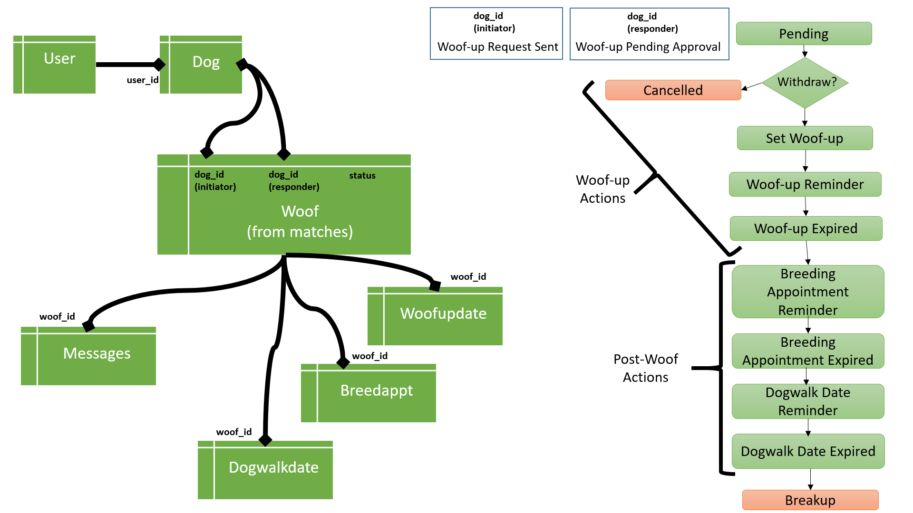
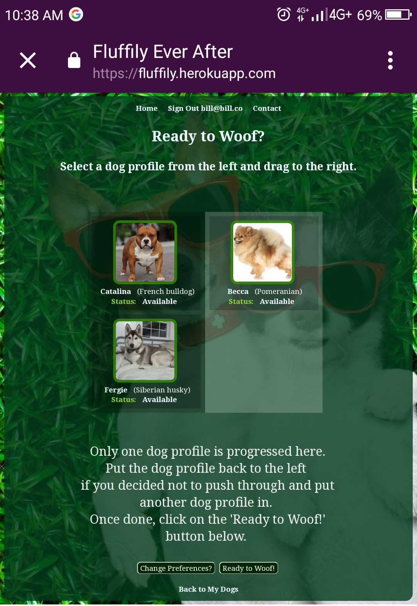

Fluffily Ever After: A Dating App for Dogs
============

Live: [Fluffily](https://fluffily.herokuapp.com/)
------------

First and Foremost, why a Dating App for Dogs?
------------

Because a Hotdogs Database might sound trivial at this point. Or, not? Point is, I was pushing myself harder to make something complicated in a week. LOL.

Anyway, for someone who has not used dating apps ever, this project is a really cute attempt. Again, LOL. But yeah, who has done a full-functioning dating app in one week? Me! And, it's for dogs. :-) 

Kidding aside, let's go technical now.

### Database Mapping Rules: ###

  * User can have many Dogs
  * Dogs can have many woofs - BUT one at a time
    * No room for cheating
    * Breakup with a fellow dog anytime
  * Woof has the IDs of the 2 woofed-up dogs and the recent status
  * A woof can have:
    * Messages
    * Woof-up Date
    * Breeding Appointments (ONCE a year only)
    * Many Dogwalk Dates

### Fluffily Story Board: ###

  * User signs up and registers a Dog (or many Dogs)
  * User views the matches for the Dog and progress from there. User can choose preferences for the Dog matches.
  (This point forward let's take the view of the Dog.)
  * Dog A initiates Woof-up, sends Woof Request. Dog A status: Woof-up Request Sent, Dog B status: Woof-up Pending Approval
    * Any of the Dogs can Withdraw at any time. Status set back to 'Available'
    * Dogs can send Messages to each other
    * AT THIS POINT, the Dog cannot be deleted. 
  * Once Dog B approves Dog A's request, both of them have status: 'Set Woof-up'. A first Woof-up meeting is required.
  * Any of the Dogs can initiate the Woof-up meeting. Once set up, their status is now 'Woof-up Reminder'
    * Every sign-in there's a notification of the upcoming Woof-up.
    * Any of the Dogs can EDIT or CANCEL the Woof-up meeting details. CANCEL sets the status both back to: 'Set Woof-up' 
    * Dogs can send Messages to each other
  * Once a Woof-up is expired, any of the Dogs can CONFIRM that the Woof-up took place. Status at this point: 'Woof-up Expired'
  * Post Woof-up options are now available:
    * Breeding Appointment (ONLY if eligible)
    * Dogwalk Date
    * Breakup --- option only be available after the initial Woof-up
  * Breeding Appointment is set, new status: 'Breeading Appointment Reminder'
  * Dogwalk Date is set, new status: 'Dogwalk Date Reminder'
  * Every sign-in there's a notification of the upcoming Woof-up.
    * Any of the Dogs can EDIT or CANCEL the Woof-up meeting details. CANCEL sets the status both back to: 'Woof-up Expired' 
    * Dogs can send Messages to each other
    * If expired, any of the Dogs can CONFIRM the Woof-up. Post Woof-up options available.
  * BREAK-UP deletes data of the Woof-ups (Woof-up Date, Dogwalk Dates, Messages, except Breeding Appointment, for safety purposes)
    * Both dogs back to 'Available'
    * Dog can be deleted.

### Technologies ###

This web application uses mainly Ruby on Rails with PostgreSQL as storage. Of course, HTML, CSS and Javascript. Yeah!

  * Front-end uses HTML utilising Google Fonts and web-sourced images
  * Styling and animations through CSS and Javacript
  * Ruby on Rails: Logic/Back-end in Models and pre-display processing through Controllers. 
     * Utilsed various Rails CRUD and direct SQL calls   
  * Javascript + Windows LocalStorage used in Notifications
  * Implemented the Drag and Drop API [Dragula](https://bevacqua.github.io/dragula/) as an alternative route to finding a match
  * Gems: Execute_Sql, LolCommits, and Spicy-Proton
  * Used Spicy-Proton gem to spice up random messages in the Messenger
  
### Wishlist ###

  * Replace background image with a non-stock photo. It's so cute I could not let it go.
  * Simplify Naviation
  * Implement triggers from DB to reload page i.e., Messenger, Push Notifications
  * Google Maps for Woof-ups

